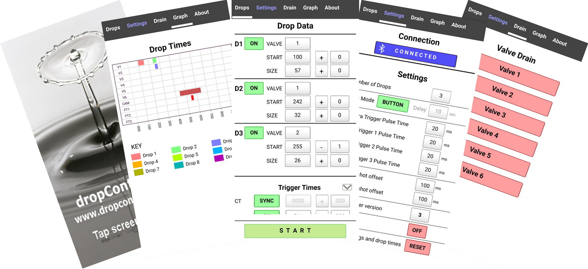

# Apps

dropControllerV3 can be controlled from either a Windows app or an Android app.
 
 

## Windows App

The Windows program does not need to be installed and is run directly from a folder. The app is writen in Visualbasic Net and requires the .net framework, minimum version 4.0, available from https://dotnet.microsoft.com/en-us/download/dotnet-framework
 

### Downloads

[dropControllerV3 Windows App](assets/dropControllerV3_2023.1.1.4.zip) (exe file inside a zip archive) 
[VisualBasic Net source files](assets/dropController_WinApp_2023.1.1.1.4_-_2023_001.zip) (exe file inside a zip archive) 
 
 

## Android App

 
 

 
 

 
 

