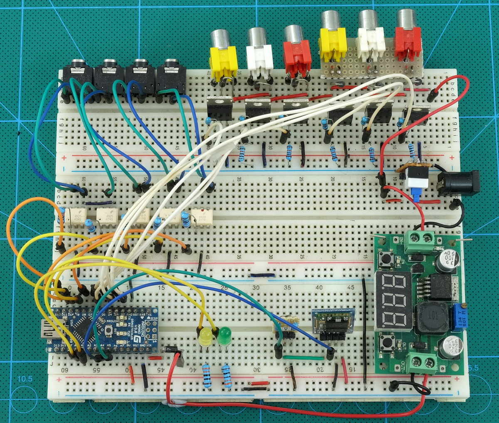
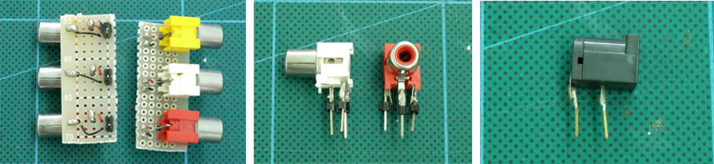
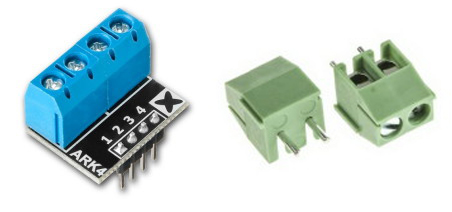

# Breadboard

I built the prototype using 3 breadboards. This gave me plenty of space. With a bit of work you could reduce it to 2 boards though, and although I called this the prototype I used it for quite a while. Which was mostly fine. I had to protect from water spalshes and it was always intertesting when something stopped working due to a lose connection.

Using breadboards is fairly straight forward as long as you remember how they work and what is connected to what. Stick in a component; connect to another component with some wire.

Some connectors can be a little difficult though. Especially the ones that are not breadboard friendly. To the RCA sockets, for example, I soldered pins to the feet so they would fit in to the breadboard holes.

Terminal blocks/connectors make a good alternative to the phono RCA sockets. If you are using a breadboard make sure you get the correct size. Breadboards are 0.1″ / .25mm spacing.

