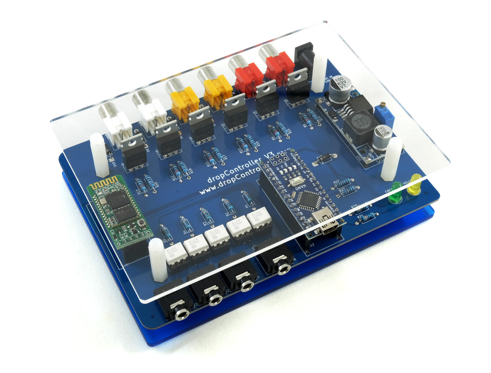
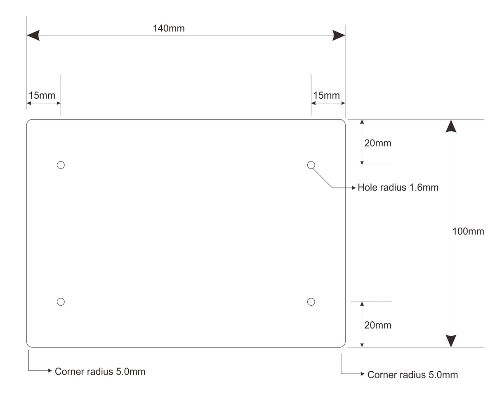

 

# dropControllerV3 Case

 
There are 2 types of cover / case  
1 - A simple cover & base  
2 - Fully enclosed case  

 
 

## Simple Cover

 
A simple base and cover can be made from 2 pieces of acrylic, Any colour can be used and I normally use clear for the top.

dropControllerV3_SimpleCover_AutoCADfiles.zip

## Downloads

The files are provided “as is,” with no assurance or guarantee of completeness, accuracy or timeliness of the information, and without warranty of any kind, express or implied, including but not limited to warranties of performance, merchantability and fitness for a particular purpose. You are advised to review and check all files before using.

[AutoCAD2000 DXF and DWG files](dropControllerV3_SimpleCover_AutoCADfiles.zip) (zip)  

 
 

## Fully Enclosed Case

 

The dropControllerV3 full case is laser cut from 2mm black acrylic.

 

You will also need stands and screws:

8 x M3  8-10mm screw  
4 x M3  10mm+6mm hex support 
4 x M3  20mm hex support  
2 x M3  10mm screw (mounting bracket)  
2 x M3  nut (mounting bracket)  
  
 
  
 

## Download

The files are provided “as is,” with no assurance or guarantee of completeness, accuracy or timeliness of the information, and without warranty of any kind, express or implied, including but not limited to warranties of performance, merchantability and fitness for a particular purpose. You are advised to review and check all files before using.

[Measurement Diagram](assets/dropControllerV3_AcrylicCase_Measurements.pdf) (PDF)  
[AutoCAD2000 DXF and DWG files](dropControllerV3_AcrylicCase_AutoCAD2000.zip) (zip)  

 
 

 
 

 
 

