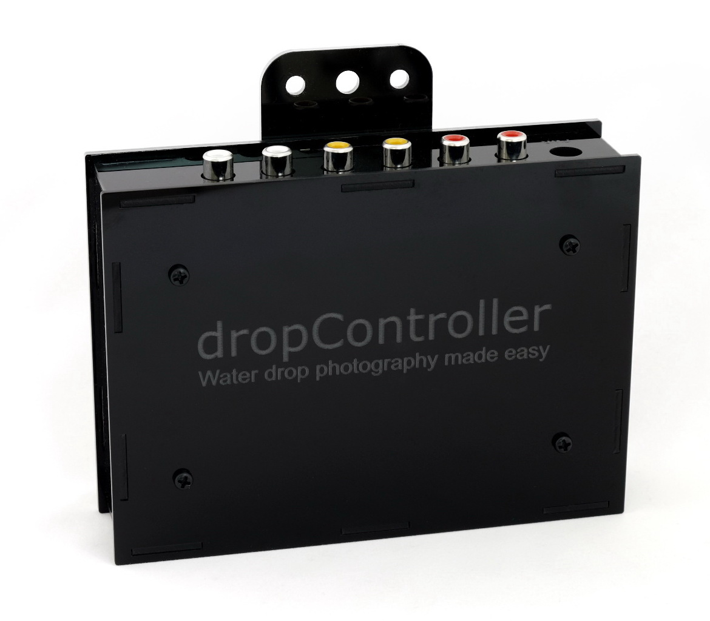

 
# dropControllerV3 Case
 

The dropControllerV3 full case is laser cut from 2mm black acrylic.

 

You will also need:

 
 

## Downloads

The files are provided “as is,” with no assurance or guarantee of completeness, accuracy or timeliness of the information, and without warranty of any kind, express or implied, including but not limited to warranties of performance, merchantability and fitness for a particular purpose. You are advised to review and check all files before using.

Measurements Diagram (PDF)
DXF and DWG files (AutoCad2000)

