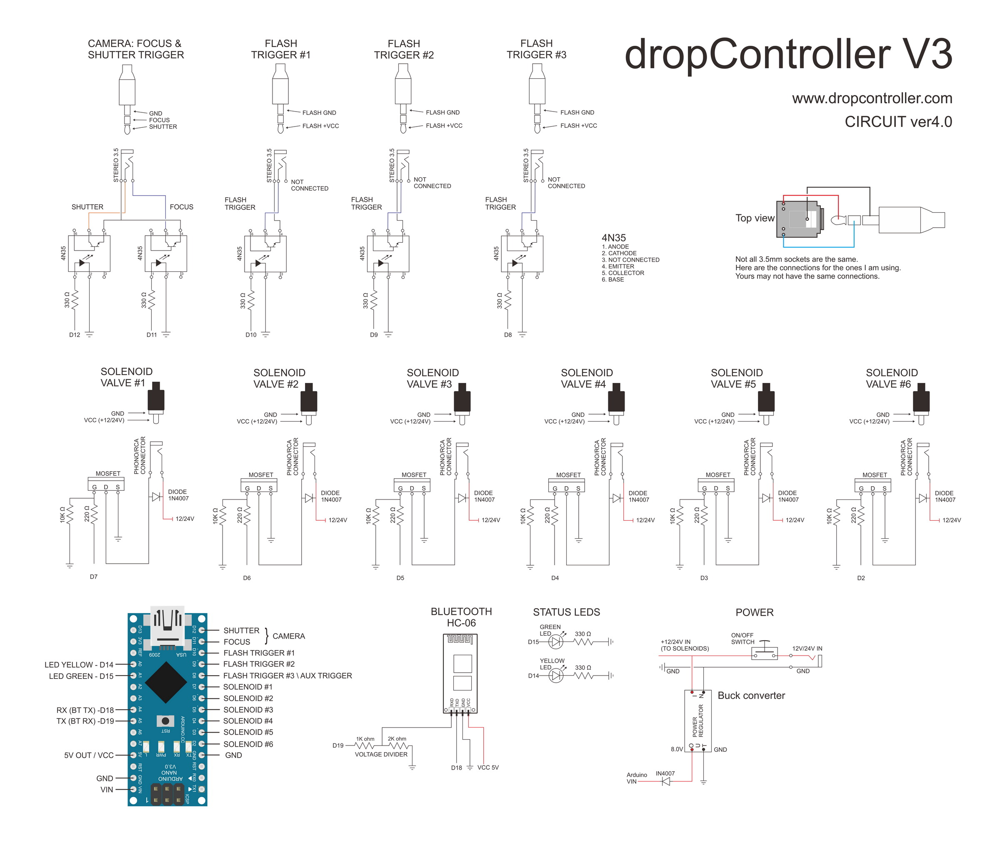
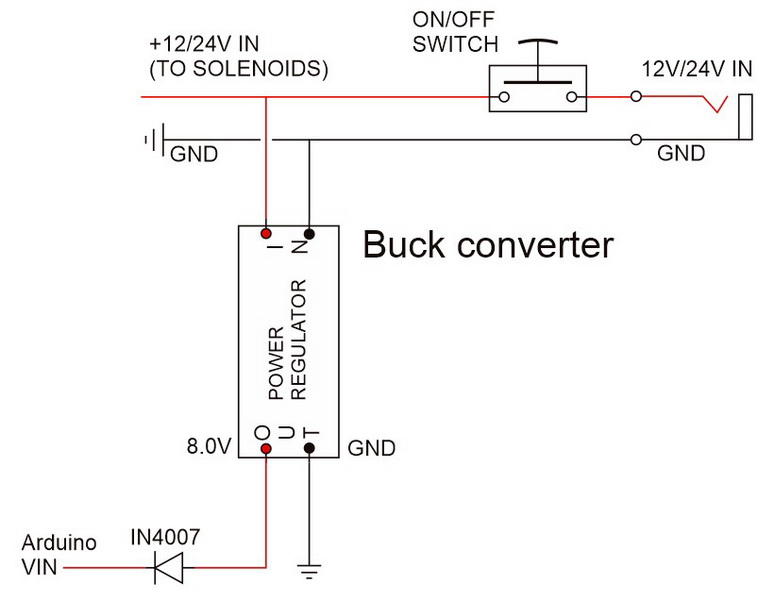
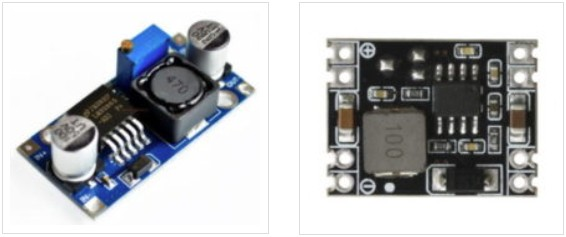
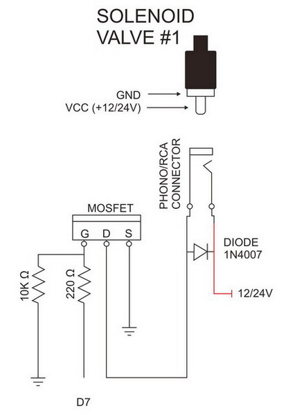
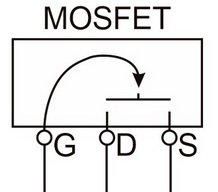
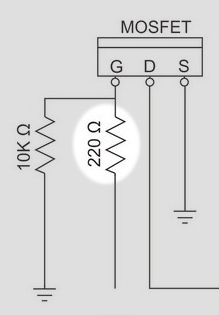
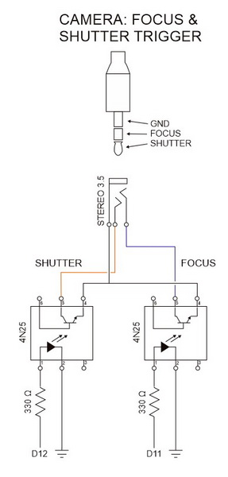
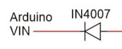
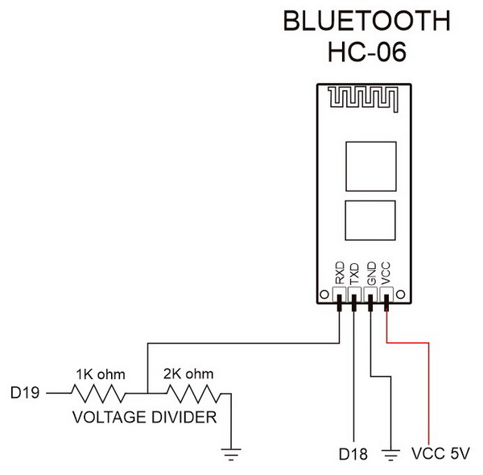

# Circuit Diagram

The dropControllerV3 circuit is fairly simple and building one should not be that difficult for anybody with any kind of electronics or Arduino experience. It will be little harder if you are totally new to electronics but not impossible. dropControllerV3 has been designed to make construction straight forward using commonly available components. Kits are usually available from www.dropcontroller.com if you prefer not to source all the parts yourself.

I tried to keep the circuit as simple as possible and have used commonly available parts. For example  4N35s, IRL540Ns (or IRLZ44Ns) mosfets, and the 3.5mm stereo sockets are the same for the camera and flash connections. 

The circuit allows the use of 12v and 24v power input. This means the same circuit can be used with either 12v valves or 24v valves. 
**CAUTION:** Do not mix  valves of different voltages on the same circuit, match he valves to the power supply; 12v power with 12v valves, and 24v power with 24v valves.

[KiCAD circuit diagram (PDF)](assets/dropControllerV3_CircuitDiagram_KiCAD.pdf)
 
 
 
 

### Parts List
- 1 x Arduino Nano V3
- 1 x LM2596s DC to DC step down buck converter (or similar)
- 1 x HC-06 Bluetooth module (or similar)*
- 1 x Yellow LED
- 1 x Green LED
- 1 x Barrel jack/power socket - DC05
- 6 x RCA/phone socket – RCA-RCJ-04x / Terminal contacts
- 4 x 3.5mm stereo socket – PJ-307 3.5mm stereo connector
- 5 x 4N35 optocoupler or similar. (I have stopped using 4N25s.)
- 6 x IRL540N mosfet (or similar. I also use the IRLZ44N)
- 7 x 1N4007 diode
- 7 x 330 Ohm resister
- 6 x 220 Ohm resister
- 6 x 10K Ohm resister
- 1 x 1K Ohm resistor
- 1 x 2K Ohm resister

Many of the components (if not all) can be swapped with alternatives. This includes the mosfets, the optocouplers, the sockets, and even the Arduino and the Bluetooth module.

* A short while ago the Waven HC-06 prive shot up and I have now started using HC-02s
 
 
### Power/VCC
The dropController circuit has three voltages; 24v/12v, 8v/9v, and 5v. The 24v/12v powers the valves, the 8/9v powers the Arduino, and the 5v powers the Bluetooth module, the mosfets, and the optocouplers.
- 24v/12v is the main power in
- 8/9v is the output voltage from the buck converter and the input for the Arduino
- 5v is the output from the Arduino and input for the Bluetooth module
- 

The ON/OFF switch is optional. I generally do not add one.
 
 
### DC-DC Step Down Buck Converter
To drop the 12v/24v to 8/9v to power the Arduino I have settled on small DC-DC step down buck converters. I use specific models but any DC-DC converter that accepts 24v+ (ideally 30v+), (mmany are 36v to 48v) input and allows 8v/9v out will be OK. Output from the buck converter goes to the Arduino.

The vcc out from the buck converter goes to the Arduino vin pin. The vin pin can safely accept anywhere from 7v to 12v so although I suggest to set the buck converter to 8v or 9v it is not critical to get it exact. The vin pin on the Arduino connects to an onboard voltage regulator which, to work correctly requires at least 6v and 6v is the lowest you should aim for. A little higher is better.
Don’t forget the diode which has a voltage drop of around 0.7v so you should have a minimum of 6.7v coming out of the buck converter. I rounded up to 8v and later found nice 9v fixed output buck converters so went up to 9v.
 
 

### LM7805/08
At a push LM7808s can be used to reduce the input voltage to 8v. A LM7808 (and suitable support circuit) will be fine when using a 12v input voltage but will likely get hot when used with 24v input. The cost between using a premade buck converter and the componets required for the LM7808 is basically the same and buck converters are far more efficient and do not create any where near the same amount of heat.

The voltages are within spec of the LM7808 but they get hot when used with 24v and some kind of heat sink is required. I found they became hotter than I was comfortable with and so I do not recommend using them. 
With an ambient temperature of about 27°C and using a 24V power source:
- no heat sink, the temperature went to around 115°C.
- small heat sink, temp was around 80°C
- large heat sink, I managed to get the temperature down to around 60°C. The large heat sink was too big to be practical though.
 
 

### Valve Control & Mosfets
dropControllerV3 is designed to be used with eithger 12V or 24V valves. 12V and 24V are too high to connect directly to an Arduino and mosfets are used as a middle man.

The solenoid valves recieve power from VCC (12v OR 24v) and are switched on and off by a mosfet which in turn is controlled from the Arduino. In this way the mosfets are used as digital switches turning the valve on and off. I use IRL540N and IRLZ44N mosfets but there are many alternatives. The mosfet needs to be logic level with a low RDSon at 5V/4.5V and more than able to handle the voltage used to drive the valves (drain-to-Source Breakdown Voltage). Always add a bit more, so if you are using 24V power supply use a mosfet able to handle 30+ volts (this would be my very minimum for 24V). The IRL540n has a drain-to-Source Breakdown Voltage of 100v so plenty of
 
 

You can think of the mosfet as a digital switch (very simplified overview), when there is a voltage on the Gate pin, current is allowed to flow between the Source and the Drain pins.

 
 

Mosfets are voltage driven rather than current driven devices and you may get away without the gate resistor. However, when a voltage is first applied to the gate pin, the mosfet can act like a capacitor and for a very short time draw quite a lot of current. The 200ohm resistor slows this down a bit and keeps the Arduino from destroying itself. A 100ohm resistor can also be used.

 
 

The 10K resistor pulls the Gate pin to ground when there is no signal from the Arduino and should be included. For one, it prevents the pin floating and causing ghost activity and for two, it stops the mosfet from going in to an undefined state which is basically a resistor and has the potential to burn up.

 
 

### Triggers & 4N35s
To isolate the camera and flash guns from the main dropController circuit 4N35 optocouplers are used. These offer some basic protection but are not 100% fool proof. When used with low voltages such as the dropController and modern digital cameras and flash guns they work well but if a large enough voltage is applied to the optocopler is can short and cause damage.

As with the mosfets the 4N35s are used as digital switches. When a current is applied between pins 1 and 2, current is allowed to flow between pins 5 and 4. The main difference between the 4N35 and the mosfet is that with the 4N35 the 2 sides of the circuit do not touch (with the mosfet the ground is common). The 4N35 controls a separate circuit without having contact with it.

 
The circuit has 4 triggers; one camera (focus and shutter) and 3 flash. In almost all cases only one flash trigger is used for water drop photography and the additional 2 can be left out if desired.

 
 

 
 

### 1N4007 Diode
The 1N4007 diode is used for polarity protection for when the Arduino is connected to a computer via USB and an external power supply at the same time.

I experienced an odd issue with one of my computers, when the Arduino was connected to the PC by usb and also had an external power source, when I disconnected the usb, the PC crashed with a BSOD.The computer worked fine while the Arduino was connected and only crashed when I pulled the usb lead out. The diode solved the issue.

 
 

### Bluetooth Module
I recommend HC-06 modules because they are fairly easy to set up, however, a HC-05 in slave mode can also be used.

There are many different versions on the HC-06 and I believe all will work with the dropController, as will any Bluetooth Classic (BT 2.1) module that interfaces using UART 8-N-1 at 9600 baud rate.
The Bluetooth RX pin is not normally 5v tolerant and so I use a voltage divider to reduce the Arduino’s 5v TX pin to 3.3v. We do not need a voltage converter on the other pin as the Arduino will read 3.3v as HIGH (the same as 5v) and so the Bluetooth TX pin can be connected directly to the Arduino RX pin.

Some of the newer module breakout boards (such as the HC01/Wavesen modules) are 5v tolerant and if you have one of these modules there is no need for the voltage divider. If you are not sure leave it in. It will not effect the circuit.

 

Separate guide for setting up a HC-06 at https://www.dropcontroller.com/setting-up-checking-bluetooth/

 
 

