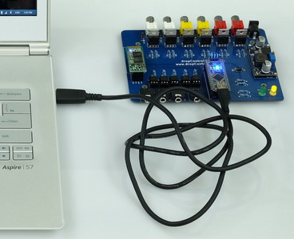
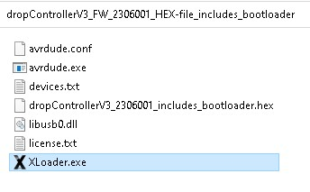
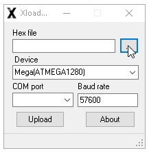
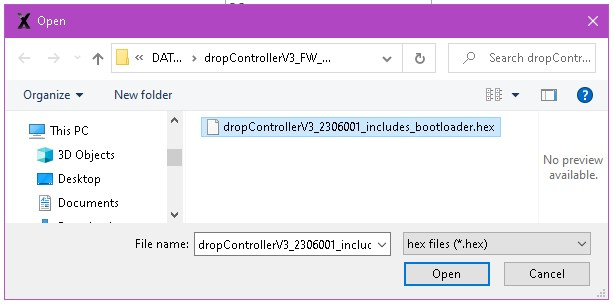
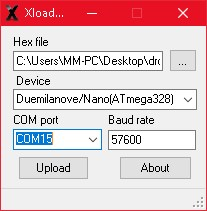
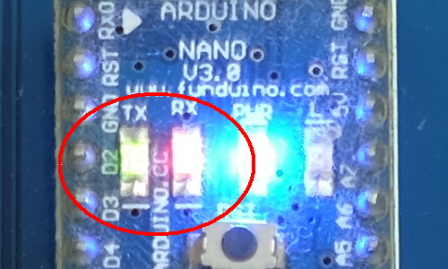

# dropControllerV3 Arduino Sketch & Firmware

  
  
  
## dropControllerV3 Arduino Sketch
Here are the Arduiono IDE files. You you will need the Arduino IDE to upload to the controller.
See the Updating the Firmware page for details on how to upload a new firmware.

[dropControllerV3_FW_2306001](assets/dropControllerV3_FW_2306001.zip) (zip)  

  
 
## dropControllerV3 HEX File

If you are not familiar with the Arduino IDE or you simply do not want to install it you can use the HEX file to update the dropController. 
The HEX file is a pre-compiled firmware ready to upload. Includes the bootloader.

[dropControllerV3_FW_HEX-file_2306001](assets/dropControllerV3_FW_2306001_HEX-file_includes_bootloader.zip) (zip)

The Download includes everything you need to upload the new firmware. The Arduino IDE is not required. See the Updating the Firmware page for details.  

  
  

# Upload the Firmware

There are two methods to update the firmware:
1 – using the dropControllerV3 sketch with the Arduino IDE.
2 – using the pre-compiled HEX file and XLoader.

If you are not familiar with the Arduino IDE, or you simply do not want to install it, use the HEX file update. This does not require any software to be installed.

 
 

## Arduino IDE

 
 
## Hex File

Download the HEX file. The download is a zip archive. Unpack it and put the folder somewhere convenient. Mine is on the desktop. Everything you need to update the dropController firmware is in the download.

Inside the folder is the dropController HEX file, XLoader, and avrdude. We will use XLoader to upload the HEX file. XLoader does not need to be installed and it is run from the folder. 

  
Attach the dropController to your computer with the appropriate USB cable.  

 
 
After the BEEP/BONG, double click the XLoader program to run it.  

 
The Xloader screen should appear. Click the button with the 3 dots to load the dropControllerV3 firmware. Since the firmware is inside the same folder as XLoader you should see the HEX file straight away.  

  

  
   
Next, select the type of Arduino you have. If you purchased either the dropControllerV3 or the dropControllerV3 kit then the Arduino is an “Duemilanove/Nano (ATmega328);m328p; stk500;57600;”. Make sure you select the m328p option.
Select the dropController COM port. In my case it is COM15. Yours will be different.

 

 

While the new firmware is uploading the red and blue LEDS on the Arduino should flash quickly.
 

 

After the upload is complete the yellow LED on the dropController should blink slowly showing the dropController is on but not connected to the app.

 
 
 
 
 
 
