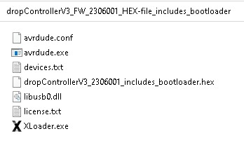

# dropControllerV3 Arduino Sketch & Firmware

  
  
  
## dropControllerV3 Arduino Sketch
Here are the Arduiono IDE files. You you will need the Arduino IDE to upload to the controller.
See the Updating the Firmware page for details on how to upload a new firmware.

[dropControllerV3_FW_2306001](assets/dropControllerV3_FW_2306001.zip) (zip)  

  
 
## dropControllerV3 HEX File

If you are not familiar with the Arduino IDE or you simply do not want to install it you can use the HEX file to update the dropController. 
The HEX file is a pre-compiled firmware ready to upload. Includes the bootloader.

[dropControllerV3_FW_HEX-file_2306001](assets/dropControllerV3_FW_2306001_HEX-file_includes_bootloader.zip) (zip)

The Download includes everything you need to upload the new firmware. The Arduino IDE is not required. See the Updating the Firmware page for details.  

  
  

# Upload the Firmware

There are two methods to update the firmware:
1 – using the dropControllerV3 sketch with the Arduino IDE.
2 – using the pre-compiled HEX file and XLoader.

If you are not familiar with the Arduino IDE, or you simply do not want to install it, use the HEX file update. This does not require any software to be installed.

 
 

## Arduino IDE

 
 
## Hex File

Download the HEX file. The download is a zip archive. Unpack it and put the folder somewhere convenient. Mine is on the desktop. Everything you need to update the dropController firmware is in the download.

Inside the folder is the dropController HEX file, XLoader, and avrdude. We will use XLoader to upload the HEX file. XLoader does not need to be installed and it is run from the folder. 

  
  
   
  
   
  
 
