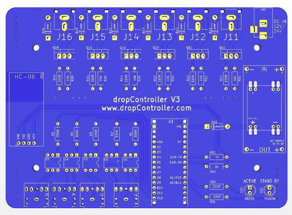

# PCB

The dropControllerV3 PCB was designed in KiCad 5.9 and updated in KiCAD V6

 

 

The files are provided “as is“, with no assurance or guarantee of completeness, accuracy or timeliness of the information, and without warranty of any kind, express or implied, including but not limited to warranties of performance, merchantability and fitness for a particular purpose.

You are advised to review and check all files before using.

Download [DropControllerV3_PCB1.60_KiCadFiles.zip (27mb)](assets/DropControllerV3_PCB1.60_KiCadFiles.zip)

 
 

## Parts Kit
A kit containing all components and parts is available from www.dropcontroller.com

 

 
 
