# Proto-Board
If you want to build a more permanent device then proto-board is a good option. Unfortunately I do not have a step by step guide but hopefully, between the circuit diagram and the below photos it should be fairly easy to figure things out.

I tried to lay out the board in a logical fashion which I used as a stepping stone to creating a proper PCB. This included positioning the sockets so that the wires didn’t overlap each other.

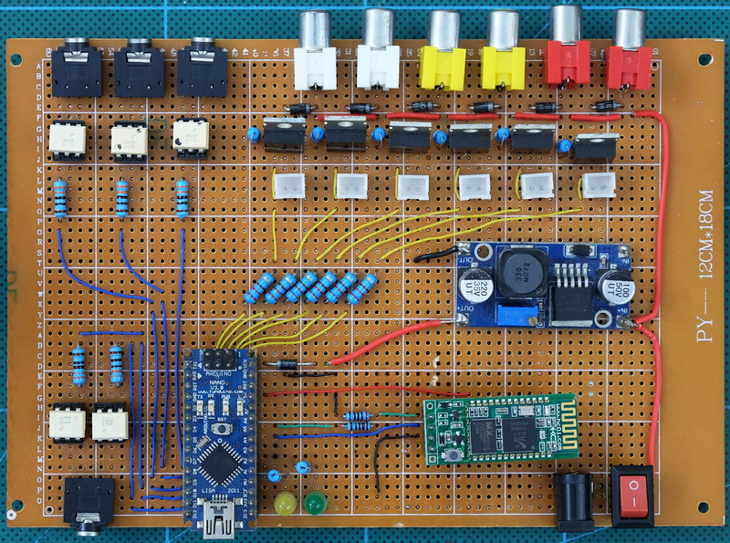

 

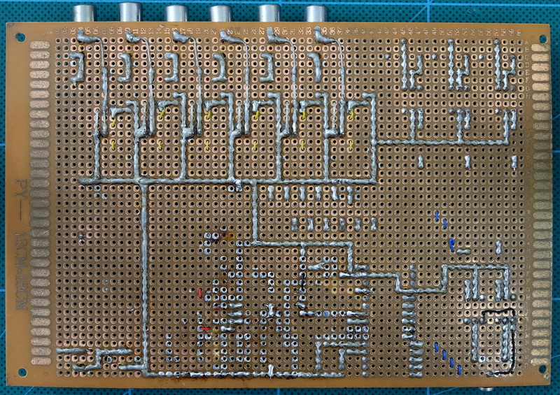

 

Top view without the Arduino and Bluetooth module
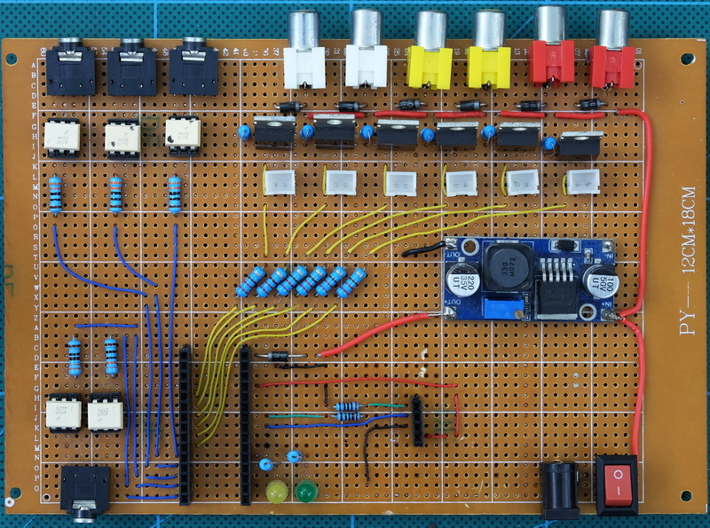

 

And here is the board with the connections overlaid.
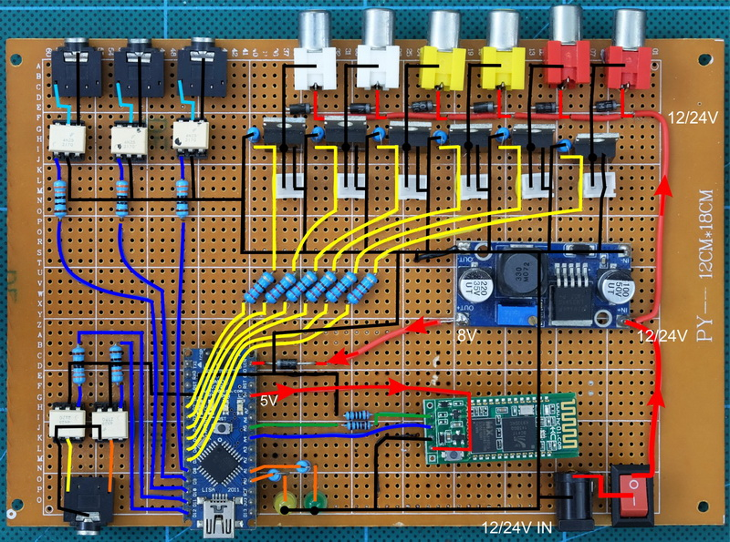

 

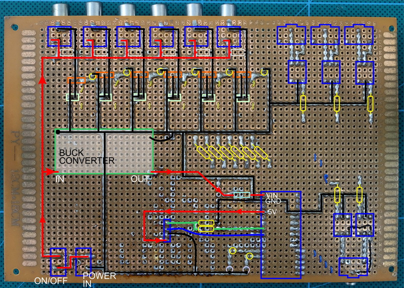

 
 

The prototype includes sockets to attach manual drain switches. These are not included on the final PCB and can be removed.

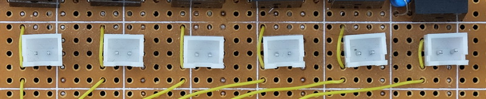

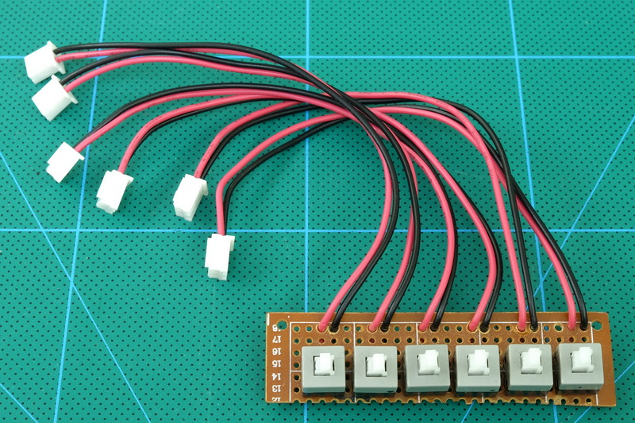

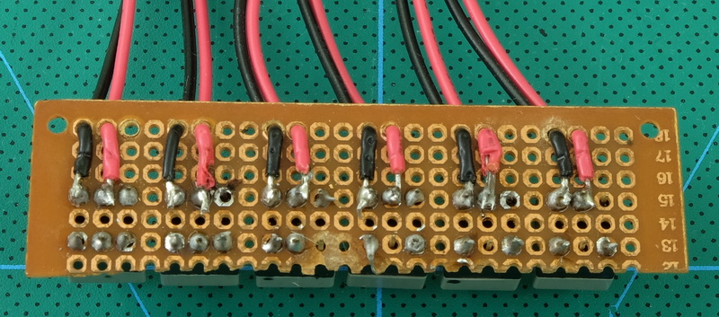

 
 

## Connectors and Sockets
The RCA sockets and the power jack socket are not proto-board friendly and I had to drill larger holes to accommodate them.
 
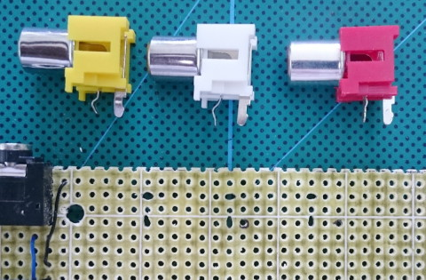
 

Rather than use PCB mounted sockets, panel mount sockets can be used. The benefit of using panel mount sockets is you only need to get the hole size correct. The position does not need to be 100% accurate. This makes construction a lot easier.
 

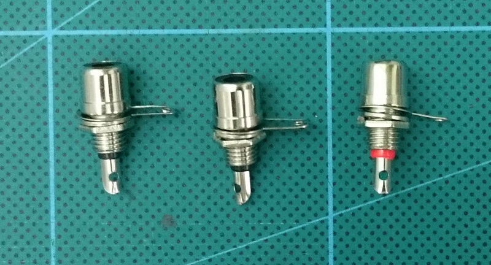
 

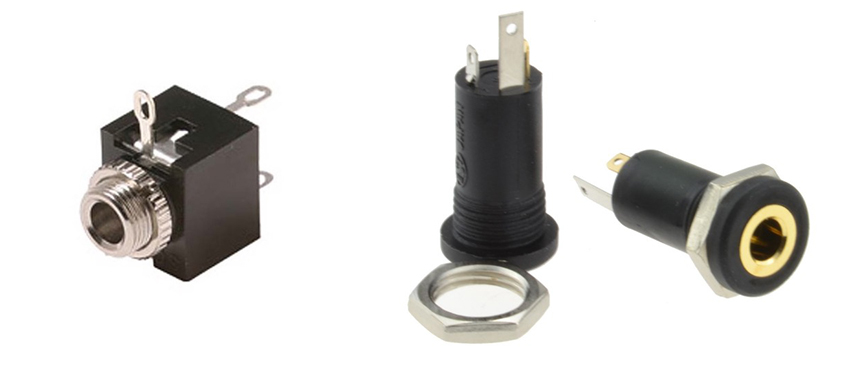

 
 

## Wire
For the power lines I used 24awg wire. For the rest of the circuit I used stripped single core wire-wrap. Single core wire-wrap wire is ideal for use with protoboarding and it is fairly easy to strip the cover.

 

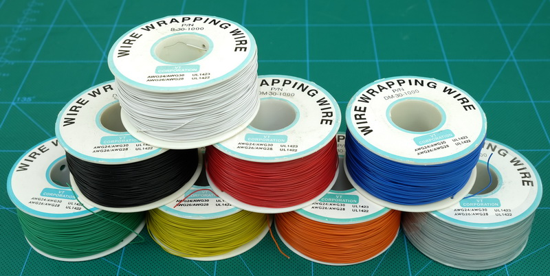

 

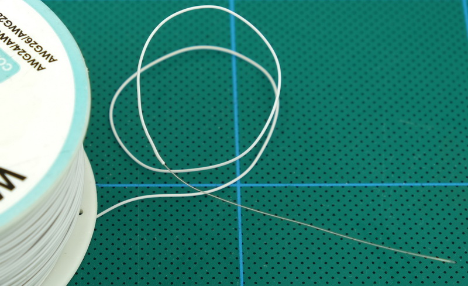

 

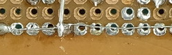

 

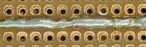

 
 

