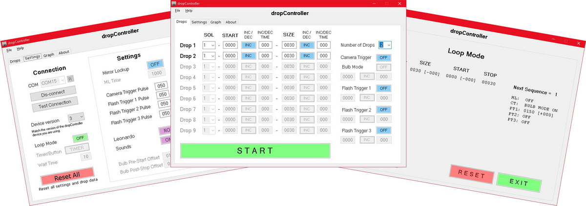

# dropControllerV3
dropController is the ultimate water drop photography system. Developed by water drop enthusiasts for water drop enthusiasts. 

 
 

### What is water drop photography?
Water drop photography is taking pictures of water drop collisions. 

 
 

## Introduction
I started drop photography many years ago and started developing the dropController when I wanted better control of the collisions and splashes. I found other drop devices limited and difficult to use and so started to develop my own system.

dropControllerV3 is now a mature, well tested water drop photograpy device. It was developed with ease of use in mind, and over time has been refined and updated to meet the needs of all droppers; whether beginner, intermediate, or advanced.

The dropController systems allow you to start as simple as you wish and become as advanced as you want. dropController allows you to start in a very simple way but does not limit you as you progress to advanced drops.

dropControllerV3 features:
- 6 valve ports
- Compatible with 12v and 24v valves. (Requires matching PSU).
- Camera and flash trigger ports
- 2 auxiliary trigger ports
- Advanced shutter trigger modes
- 3 independent trigger controls
- Loop Mode using delta values (easy collisions)
- Auto save drop data
- Auto save main settings
- Compatible with cameras that have a wired shutter remote function
 
If you want more than this take a look at dropControllerV4 (www.dropcontroller.com)
 
 

## Apps
dropControllerV3 is controlled from an Andoid app (via Bluetooth) or a Windows app (via USB). Sorry, no IOS version. apple uses please have a look at [dropControllerV4](www.dropcontroller.com)

### Android App

 
 

### Windows App

 
 

## License
dropControllerV3 is [Source-available software](https://en.wikipedia.org/wiki/Source-available_software). Free for personal use but not fully open sourced. You are free to use and modify the designs and code as you please but please do not copy and sell.
 
 
 
 

[Circuit & Components](CIRCUIT.md)  
[Breadboard](BREADBOARD.md)  
[Proto/perf board](PERFBOARD.md)  
[PCB](PCBmd)  
[Case](CASE.md)  
[Windows App](WINDOWS-APP.md)  
[Android App](ANDROID-APP.md)  
[User Manual](USER-MANUAL.md)  

 
 
 
 

